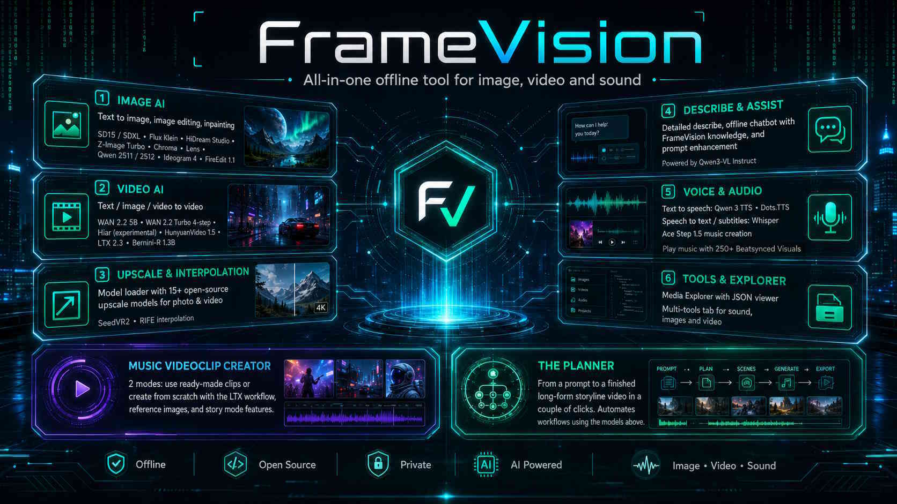

  

 
                                  
✨  FrameVision 2.5.1  ✨
 
     
All-in-one Sound/Image/Video Tool 
  
     
Create, Edit, Upscale, Play 
                              

---
- Comes with a simple setup menu and a one click installer for the main app,
- -->  3 options : check requirements / repair-reset app / full (Cuda) install -> It will install an environment for the app and the smaller models such as upscalers)
- The bigger models can be installed/downloaded/removed or hidden inside the app.
- Installer uses Python 3.11, if the system cannot find python 3.11 it can install this (together with GIT, miniconda and other needed tools to run local a.i. models)
- RTX graphics card with 12 gigabyte vram or more is advised for image and video models, smaller models and the multi tools section can run on CPU or low vram.
 -> This app has been tested on a budget am4 motherboard with an amd ryzen 5900x + Rtx 3090 and 64 gig ddr ram. Make sure to enable pagefile and set it to 'auto' in windows to cover the bigger model loads.
- Windows may show a Defender / SmartScreen warning the first time you run FrameVision .bat or .exe files, because the app is open source freeware and a hobby project so it's not code-signed (which costs money). This is normal for unsigned selfmade apps. -> Only continue if you downloaded this from the official GitHub. Click More info → Run anyway when you trust the source. When unsure, scan the folder first or ask Chat GPT :-)

---
 
      FrameVision available models & feature list.
   
---
- 💬 LLM Chat : your own little (offline) chat gpt at home. Load any (gguf) model and start chatting/coding/creating images, video, even music with the installed models.
  Chat memory allows user for the chat to remember something in new chat
- 🎨 TXT → IMG with SD15/SDXL- Z-Image Turbo - Chroma - Lens - Qwen 2512 - Krea 2 - Ideogram 4)
- 🖌️ Image edit, reference, inpaint, (some also include txt 2 img)... with Qwen2511, Hi-dream studio,  Flux Klein, Boogu image and Fireredit 1.1
- 🎬 txt/img/video to video with WAN 2.2 5B/ Wan2.2 Turbo 4 step - Hiar (experimental) - HunyuanVideo 1.5 - LTX 2.3 - Bernini R 1.3B (base on wan 2.1 also does image and video editing)
- 🧪 Upscaler with model loader (15+ open source upscale models for photo & video) + seed2VR
- ⏱️ RIFE Interpolation
- 📝 Describe in detail, offline chatbot with framevision knowledge and prompt enhancement with Qwen3 VL instruct.
- 🎙️ Text to speech with Qwen 3 TTS (full model pack includes voice cloning and creating own style voices from a prompt)
- 🎙️ speech to text or subtitle creation with Whisper
- 🎵 (music) videoclip creator : 2 modes : use ready made clips or use ltx workflow to create a clip from scratch with reference images and story mode features
- 🎵 Ace Step 1.5 Music creation, probably the best open source a.i. music creation tool of today.
- 🎶 Music player with playlist & 250+ beat synced visuals
- 📁 Media Explorer with Json viewer.
- 🖌 Remove Background (+ basic (sdXL) inpainting)
- 🧠 The Planner : from a prompt to a finished storyline long form video in a couple of clicks, it can use all of the above models in an automated workflow.
- 🎬 video timeline editor : little python based openshot clone (beta test)

---
 
 🧰 Multi tools tab :
   
---

 - Change speed for videos (with audio sync).
 - Reverse video / boomerang
 - Thumbnail/meme creator for easy adding text with effects to an image
 - Image FX Lab for changing colors or adding effects to images
 - Sound edit (mini audacity)
 - sound mixer for adding extra or new sound/music/speech to a video
 - Resize image/video 
 - Create Gif files : 2 sections -> use currently playing video or load images from a folder
 - Extract/join frames
 - Trim videos with preview
 - Crop videos/images
 - Multi rename/replace for filenames
 - Metadata/date editor/remover
   
---
 
 In App features
   
---
   
- 📋 Advanced Queue with seperate worker for almost all tools
- 📋 Extra features for some tools/models such as Batch, Extend, use end frame etc   
- 📋 file menu with recents/favorites/converter
- 🧮 Vram and DDR manager (beta) for a couple of the bigger models
- 🧮 System Monitor with live info, environments check and colored Hud
- 🕹️ EASTER EGGS : use the app to unlock them
- 📺 in app resizable Multi media player with zoom/pan and compare side by side tools.
- 🎨 25 Themes, visual effect overlays at startup, random startup screens, banners, font resize, nimated buttons, icon pack and many more visual on/off settings for the app. 
   -> copy and use your own startup screens or in app default mediaplayer image.
- All kinds of extra's i forgot to mention such as 3rd party license viewer, uninstaller/model hider, an (auto) in app updater, a Knowledge base with q&a etc.
---

 
  ## 🛠 Installation

---   
Run **`framevision.exe`** — it automatically:
1. Opens the installer menu if setup is incomplete. (give 1 time approval in windows to use an unknown app)
2. select 'check requirements' if you never installed something A.i. related before to have environment, git, python, miniconda,... installed before you start the install of the app.
3. After install it starts the app and background worker. (Always keep the background worker open when using queue)
4. select an optional install in the app (optional downloads menu) to get the model(s) you need (wan 2.2, hunyuan, z-image,..) Hide/delete models you don't use in the hide/remove menu

### Installer Menu Options
- 1 **check requirements** + basic 'first time ai' installer.
- 2 **Core Install:** App only (minimal).use this if app stops working to get a quick reset.
- 3 **Full CUDA Install:** Torch CUDA setup + small models/binaries/ffmpeg bundle
---
 
 User friendly, Portable & offline
   
---
   
- install must go to c:\framevision-main, once everything is installed no more internet is needed and you can move the folder to any other location on the drive.
- One click install tries to make everything work 'out of the box' (git, python, environment..) even for 'new to ai' users (Z-image gguf models may need extra install of visual studio when you get error of missing dll files. This is rare and not included in the installer)
- Tooltips almost everywhere (can be turned of in settings tab)
- Draggable middle splitter & swap ui to make the app look the way user wants. (Drag completely to one side to get a full screen for the tabs or the media player)
---
 
  Update changelogs 
   
---

June 28 2026 Framevision V2.5.1 small uopdate brings Krea 2 and Boggu img

  
  - Krea 2 GGuf loader, download your favorite version for Vram use and use it it framevision
    Fast and detailed images. Works with sd-cli for an easy & fast install
  
  - Boogu Image comes as a text to image and an image editor in 1
    Users can download fp8/fp16/ or gguf. Works with sd-cli for an easy & fast install
  
  - More features for the llm chat :
    - Pinned chats : Users can enter special prompts, save them to pinned chats and re-use them later
    - Memory : chat has several types of memory : chat own memory (add anything in here you want to load
    with the llm when it creates an answer, user notes (where it saves when you type 'save to memory' or
    and projects (save to project 'name of project' so you can take work with you to another chat or llm.
    - Answer with voice : simple tts engine (piper) for fast text to speech.

  - bugfixes
    + when using the video timeline editor inside framevision, it often froze the whole app, should be
      fixed now. Also added a new layout and made it default, splitters work better and font can go as
      small as 6px now to show everything on 1 page.
    + fixed planner sometimes still pointing at old test workflow for ltx 2.3 & added Krea 2 to the list
     

    

June 25 2026 Framevision V2.5 brings llm into framevision

  - LLM-chat is a gguf loader for large language models with special options added such as image creation/editing, text/image or video to video and music creation.
  - added my video timeline editor in to framevision
  - various bugfixes and improvements

June 16 2026 Framevision V2.4.2 small update

  
## Added Bernini R, the 1.3B version for low(er) vram

- Add objects or make edits to existing video (change color dress, add a cat,...) but slow
- Add objects or make edits to an existing image (fast and low vram)
- text to video and text to video also is possible but not super quality
- there are more features such as using ref image in existing video and changing what happens in an existing video but those are esperimental/don't work very well.
- Comes with an advanced guidance settings tab (hidden by default, can be turned on in settings) for testing and finetuning

## Image FX lab

simple tool to change colors or add color effects to images
some of the features : 
brightness/sharpen/black&white/sepia/blur/invert/hue.. and many more
Comes with 14 effect presets

## Various fixes
- Hunyuan 1.5 should now use a lot less vram when enabling vram lab, keep on auto when you have lower then 24 gig of vram. Also leave CPU offload and VAE tiling on for faster results

June 13 2026 Framevision V2.4.1 small update

 ## Z image turbo gguf now includes a new tab for selective edits
  - beta/experimental
  - it allows user to add a mask in an image, add a pompt of what should happen inside the mask and replace/change the mask with a newly created z image section while the rest of the image stays unchanged
  - it should also be able to do referencing like image to image.
## Ideogram 4 : Visual json prompt boxes
  - Json prompt builder with prompt boxes so you can use exact location in an image to show what's in that part of the prompt
## more fixes :
- lora loading in ltx fixed (vram lab tab also has an extra toggle for faster lora use, but this only works for text to video)
- wan 2.2 video extend now also works with framevision queue instead of only direct runs.
- Fixed planner using queue in framevision (review/recreate is disabled while queue is running to avoid double gpu use)
- Fixed LTX workflow in music video clip creator to be able to use framevision queue as well
- system monitor / logs / cleanup updated

  

 
  

June 8 2026 Framevision V2.4 update

## Models that join the list
(Install from the **Optional Downloads** menu.)

### LTX 2.3 Model Loader

* Choice between:
  * **FP16** — fully configured with VRAM Lab to work on 12 GB+ cards.
  * **FP8** — experimental, because my rtx 3090 cannot test it properly.
  * **Your own finetune fp8/fp16** - loading your own checkpoint should also work (tested with sulphur fp16)
* Install comes with the updated **distilled 1.1 checkpoint**.
* Works for both one phase and 2 phase (faster) runs
* Available resolutions and max. possible frames with vramlab in one run:
  * 480p (up to 721 frames on rtx 3090) *june 11 update : now max 1201 frames
  * 720p (up to 577 frames on rtx 3090)
  * 1080p (265 frames max. on rtx 3090 before 24 gig vram is full)
  -> lower vram profiles will have lower macimum frames
  -> For longer videos -> use finished video to start the next one for unlimited duration
* This model is huge, so make sure there is enough disk space before installing.
* LoRA support is currently in beta and still needs more work.

### Ideogram 4 GGUF Loader

* Comes with 3 presets:
  * **Turbo** — 12 steps.
  * **Default** — 20 steps.
  * **HQ** — 48 steps.
* Rumored to be one of the best open-source text-to-image creation models so far.
* Uses a GGUF loader that needs both:
  * A **conditional GGUF**.
  * An **unconditional GGUF**.
* For the conditional GGUF, choose a higher-quality quant when possible. Only pick Q4 if you have less than 12 GB VRAM.
* The unconditional GGUF can be Q2 and images still look pretty good.
* This is not a fast model.

### Chroma Text-to-Image
* Added support for the popular **Chroma** text-to-image model.

---

## New or Improved Features

### Updated Remove / Hide Section

* Easier to hide models you do not use.
* Easier to remove environments and models you no longer need.

### FrameVision VRAM Lab and DDR Manager Beta

* First beta version of a tool that tries to keep bigger models under control.
* Helps prevent models from spilling into shared memory.
* Configured and automated for:

  * **LTX 2.3**
  * **Wan 2.2**

### New LTX Tab in Music Videoclip Creator

* Add a storyline.
* Add reference images.
* Add a couple of scenes.
* Add a music track.
* Click generate LTX videoclip.
* FrameVision automates the rest and creates a music videoclip when finished.

### Planner Improvements

* Planner now officially supports **LTX**.
* Planner now also supports newer image models such as **Lens**.
* Reference images can now also use **HiDream** for better open-source character bibles in stories.
* Enabling LTX allows full runs with both start and end images.
* This makes it possible to create one long one-shot story video with only a few button clicks.

### Queue Cleanup

* Queue cleanup now runs automatically at every app start.
* This should help solve video stutter caused by too many finished jobs needing to be updated.

### Auto Update

* Added a new **Auto Update** toggle in Settings.
* When enabled, FrameVision can automatically check for updates at app start.
  

---

## Fixes

* Various fixes and small improvements across the app.

May 25th 2026 V2.3.5 small update brings Lens image Turbo

__________________________________________________________________________________
  
Lens image, install it via the optional installs menu, very fast model for image creation (only 4 steps)
several bugfixes or ui improvements, queue now only gets 10 last results with auto clean after restart.

May 10th 2026 V2.3.4 small update brings Hidream Image/edit base and dev model (fp8+bf16) + May 17th : included the updated hidream 2604 dev model

__________________________________________________________________________________

- Hidream Image : probably the best open source image edit ai of the moment
- if you already have installed Framevision, just do an update inside the app to download all new files and restart the app, it will be added to optional installs and you can install it from there.
- choice between base and dev model, (BF16 needs up to 20 gig of vram, fp8 fits in 16 gig vram)
* May 17th, i also included the bf16 version o the updated 2604 dev model, for me it gives worse results then original dev, but it is quite a lot faster so i included it anyway

April 11th 2026 V2.3.3 small update brings new XL models for Ace step 1.5

__________________________________________________________________________________

- Ace step 1.5 : all 3 new models are added, will be downloaded on first use
- Beatsyncvisuals : simple tool to add equalizers or other visuals to music videos
- transition_video : another simple tool to assemble videos with transitions
- planner can now load your own llm for story creation (needs testing)
- couple of improvements and bugfixes here and there.

March 15 2026 V2.3.2 small update brings Firered edit 1.1 (GGuf loader) & Hiar Long format video generation with wan 2.1

__________________________________________________________________________________

March 09 2026 V2.3.1 small update brings Flux Klein 4b and 9b GGuf loader

__________________________________________________________________________________

Flux Klein (GGUF image + edit + GGUF manager/downloader)

- Choice between 4B and 9B image, download the Q version that fits your vram
- available both in planner (reference image and image creator) and in the image edit section
- Create/edit images at blazing speed (not good for text or NSFW)
  
  UI improvements / fixes
  
- Added new features, tooltips, and improvements in the Sound Editor
- Reorganized a couple of tabs
- Added Load/Save lyrics buttons in AceStep 1.5 (with organizer)
- Added Ace Step to FrameVision internal queue & worker system
- Loading another model in Ace Step 1.5 now automatically changes needed steps
- Added a right-click menu in the Planner results page
- Added 720p in Planner for SeedVR2 upscaler
- added a toggle to enable 20 (random) camera effects in the planner
- Various bugfixes and other improvements
- in helpers folder at the moment there is a 'llama_chat_ui.py' in beta test
  > it allows you to use your own downloaded (gguf) chat llm's (gemma, gpt, qwen 3.5,..) to use and
  > interact with them

  

February 15, 2026. V2.3 new Planner : Go from prompt to finished video with narration and/or music (with Ace Step 1.5!) in a couple of clicks

  
🧠 The Planner (Idea → Finished Video)

End-to-end creation (idea → finished video)

- Turns a single idea/prompt into a structured video plan (story beats + shot list)
- Generates shot-by-shot prompts with a natural flow (hook → build → payoff)
- Produces a complete output: clips + narration + music + final cut + export
- Exports a run as a reproducible job (so you can rerun or improve it later)

Automated story & character control
- 📖 Character Bible: define up to 2 detailed characters used across story + prompts
- 🧩 Own Storyline mode: paste your own numbered beats ((01)…(02)…); each becomes the next beat (Disables automatic character-bible/storyline creation so your manual story stays in control)
- 🛡️ Alternative Storyline mode: safer story mode for animals/aliens/creatures to reduce “too human” drift (hands, faces, body language)

Reference / identity mode (character consistency strategy)
- 🎨 Reference-based repaint: uses reference images to “repaint/guide” shots so the subject stays consistent while scenes/actions change
- 🧬 Qwen Edit 2511 identity mode (best consistency): keeps character identity as stable as possible across shots when normal prompting drifts

Per-shot generation + regeneration
- 🎬 Generates video clips per shot
- 🔁 Regenerate individual shots/clips (no need to restart the whole job)

Narration + music + final assembly
- 🗣️ Generates narration text from the story plan
- 🎵 Music via Ace Step 1.5 with ~50 genres (instrumental, your own lyrics, or AI lyrics based on storyline)
- 🎛️ Can use Music Clip Creator for the final video

🧱 Auto-assembles a final-cut timeline
- 🎚️ Aligns narration + music and exports a finished video in one workflow

 Optional post / workflow controls
- 🆙 Upscale final output (optional) — chose between SeedVR2 or realesrgan 
- ⚡ Interpolate to higher FPS (optional) with RIFE for smoother motion
- 👀 Optional review checkpoints to inspect/edit results mid-run
- 🎲 Optional retry with new seed when the result is close but not perfect

Results / History + Resume (core workflow)
- 🗂️ Results browser / job history for finished, failed, and cancelled runs
- ▶️ Resume button continues the pipeline from where it stopped (or edit finished results)

🎶 Ace Step 1.5 — Music Creation

- 📦 Install via Optional Installs: downloads/installs the environment + repo + Turbo model
- ⏳ Other checkpoints download on first use (expect the first run to be slow)
- 🧾 Simple view: Prompt + Negatives + Lyrics, many 'auto' options for one click generation 
- 🎚️ Full settings control: duration, BPM, seed, etc. (many include Auto / “let Ace decide”) + advanced settings for model selection etc
- 🧰 Genre preset manager: add/edit/remove presets — includes 60+ example genre presets, edit, remove or add (sub) genres

🎨 UI Improvements

- ➕ Added Ace Step 1.5 to Optional Installs, System Monitor, and the Remove/Hide menu
- 💾 Music player overlay now remembers whether visuals are ON/OFF after restarting the app
- 🧩 Various small UI improvements

🛠️ Bugfixes

- 📝 Whisper: fixed a crash when extracting subtitles from video
 

🧹 Removed

- ❌ Removed cpu install from the installer, wasn't updated for a long time and no longer working properly
- ❌ Old Ace Step model removed from the installers and the app
- ❌ HeartMula removed from the installers and the app
( 🧽 If you’re updating from an older version, you can manually remove the old Ace Step and HeartMula environment + model folders)

  
Januari 24, 2026. V2.2.2 small update adds Qwen3 Text to speech and Whisper speech to text

Qwen 3 Text-to-Speech
- Base
- Custom voice (uses built-in speech models)
- Clone voice (upload a sample to create cloned voices)
- Voice design (create your own voice with prompts)

Whisper
- Voice → text (subtitles / transcript)
- Burn subtitles directly into the video (hardcoded subtitles)
- Multilingual speech recognition
- Optional translation of transcript/subtitles to English  

  

  
Januari 19, 2026. V2.2.1 small update adds HeartMula Music creation

- HeartMula
  
    - Create music offline
    - Good for vocal pop, rock, R&B (and more genres)
    - Good sound quality with default settings
    - Create up to 4 minutes of music in minutes
- UI Improvements

  - Optional Installs: Remove / Hide manager
    - Quickly remove installed/unused models / repos / environments
    - Options: Delete, Hide, or both
    - Detailed info per model: paths (folders/files), size on disk, etc.

  
Januari 17, 2026. V2.2 update adds qwen2511 & 2512

  New Features

  Qwen 2512 GGUF loader
  - Install from Optional Installs
  - Find it in txt2img with the other txt2img models
  - Added support for Turbo LoRA (and other LoRAs) — get images in only 4 steps
   
  Qwen2511
  - GGUF loader, download extra models via Optional Installs menu
  - Mainly for testing / not fully working like in ComfyUI yet
  - Use reference images + prompt for edits
  - Offload options
  - Flash Attention
  - LoRA support (tested with the multi angle LoRA)
  - 96 angle toggle for easy use of the multi angle LoRA
  
  New Background Remover + SDXL Inpaint (with model loader)
  - Removed the old all in one background remover / (bad) SD15 inpainter
  - Replaced with 2 complete new (separated) tools
  - Background Remover is more user friendly and simplified (recommend 720p+ start images to avoid bad cutouts)
  - Pan/zoom + brush for high detail background removal
  - User can load an image as new background; original cutout/mask can be moved + resized to fit the new background
  - Inpainter now loads SDXL instead of SD15 models (one included in Optional Installs)
  - Easy flow: load image → load mask → enter prompt → done
  - Background remover works on any PC
  - SDXL inpaint works on GPU as low as 6GB VRAM (8GB recommended) — use this if Qwen Edit 2511 is too VRAM hungry
  
  UI Improvements
  - Interpolator: added “interpolate x3” shortcut + manual number input; compression removed so output files now keep source quality
  - License viewer (MIT, Apache, …) added for all tools — find it in Info menu or in Optional Installs
  - 4 new themes: Blue / Orange / Green / Red in the dark
  - Banner: new function — gradient rainbow colors with slider for speed
  - Better defaults for new user installs (Settings + Videoclip Creator)
  
  Bugfixes
  - Fixed Media Explorer bug where it would become slow after image(s) got scanned
  - Fixed banner showing up after restart in Settings
  - Fixed banner not hiding in Videoclip Creator

  
Januari 1, 2026. V2.1.2 Happy Newyear and another update

  
  
- fixed themes freezing app for 5 seconds after applying (added a 'safe apply' button in case freezing comes back)
- fixed trim tool freezing ui while generating preview
- fixed upscaler defaulting to 30fps
- fixed tab integration still thinking upscaler was a main tab (finaly found why upscaler needed restart to apply new upscaler engine/model)
- fixed compare tool crash when loading new media file while repeat button was on.
- fixed compare tool sync problems for video (85% lol)
- added a date/time changer to the metadata editor
- added a couple of simple effects to the text on top of video overlay tool
- added 'strobe on time' in the video clip creator, now you can pick the perfect moment for a strobe effect
- Behind the scenes upgrade : Moved queue to it's own python file, no longer inside the big main framevision python file. This may come with new bugs, i will fix them as i run into them  

  

  
December 28, 2025. V2.1.1 mini update

Bugfixes
- fixed optional installs: background model + Z-image fp16 installer
- fixed move up/down in queue (pending) + right click options restored for moving
- fixed shrink feature for repeat button
- fixed adding Music Clip Creator jobs to the queue, queue-ing button restored
- fixed filename for random seeds in Hunyuan
- not 100% fixed yet: queue finished results — if video playback or visuals from music player stutter: clear finished results in queue
---
UI improvements
- more “View Result” buttons (most tools now have it)
- new Settings toggles ;
- animated hover effects on some buttons (6 animations + random)
- Change font size
- moved buttons to front in queue (finished)
- simplified treeview in Media Explorer
- updated Features HTML + a big part of the Knowledge Base in the Info menu

New features
- VideoText (beta test)
  - allows adding text to video
  - choice of font, size, position
  - unlimited text adding
  - adjustable fade in/out
  - preview toggle to always show all text
  - preview timeline with zoom/pan/drag/drop
  - text effects
  - load/play/pause/stop/save

  
December 25, 2025 — v2.1 release notes

**✨ New Features**

- Music Videoclip Creator
  - Added more transitions, cinematic effects, and drop/chorus effects
  - a couple of extra settings such as 'skip Fx in intro'
  - new 1 click preset : 'get it done FAST' (3 minute videoclip in less then a minute, only uses easy to render effects and transitions)
- Reverse video tool
  - Simple tool to fix AI videos that run backwards
  - Supports batch, queue, use currently playing video, and load video
  - With boomerang (reverse-forward-reverse-...) feature
- HunyuanVideo 1.5
  - TXT → video, IMG → video, video → video + video extender
  - Engine selection for 480p & 720p
  - Model choice: normal, distilled, low step (only for 480 img2vid model)
  - Each model downloads ~30GB extra files, 720p model is 50 gigabyte
  - Aspect ratio for all resolutions (192p–720p): 1:1 / 16:9 / 9:16
- Media explorer tab
  - Replaces the buggy “last result” screens from every model,
  - Most tools now have a 'view results' button which will open the folder, scan for json files and show all results in the media explorer.
  - Double click plays them in the app multi mediaplayer, right click give extra options such as :
  - Search/sort/play/preview/cut/copy/paste/delete/rename/favorite+...
  - User can scan any folder + subfolders (or open basic tree view) (Huge drives with video can take longtime)
- Z-Image Turbo GGUF Model loader
  - Get FP16 or a GGuf variant for the Z-image Turbo image creator
  - use them in a model loader, queue allows combining any model
  - Q4–Q8 variants allow fast image creation on virtually any VRAM
  - may give an error for missing dll on some computers, popup will point to windows file for install of visual studio
- Optional downloads
  - a new menu for optional installs (moved from the installer into a new part of the app, so user can decide later what to install
  - Currently includes : Z-image fp16 + gguf model downloader, Hunyuanvideo 1.5, wan2.2 5b, a model for SDXL, background/inpaint models, ace step music and a face restorer These are no longer installed with the app by default and can be skipped/installed in here to save time on first time install of the app

**🎨 UI Improvements**

- Music video creator beat-synced visuals now come with a preview thumbnail, i included ready thumbnail pack (to avoid long wait at first time use)
- Repeat button for video files (shows up when a video file is loaded, hides again when images are loaded, music player already has it's own repeat features)
- Right mouse button in queue for running & pending get a couple of options (cancel running job, move back to pending, delete job from pending, show JSON info)
- Prompt enhancers directly under prompt box in WAN 2.2 / Hunyuan 1.5 & Z-image / SDXL
- Wheel guard: avoids accidentally changing settings while scrolling over something with mouse
- Reorder tabs & tools (upscaling, Rife, Qwen describe, background remover and Ace Music now are in tools tab)
- Settings have a new toggle that allows reordering the main tabs, Tools tab also gets a reorder toggle.
- HUD now also shows internet traffic up/down (when above 50kb/s) to be able to follow 'silent downloads' of some models 

**✅ Bugfixes**

- Z-image
  - Fixed Z-image not staying at 0 CFG after restart
  - Z-image text encoder CPU offload fixed
  - Queue names for Z-image fixed
  - Added all resolutions up to 4K
  - Added LORAs back to the UI (needs testing)
  - Fixed Z-image info in worker
- Music Videoclip Creator Fixed beat-synced visuals “no beatsynced visual” toggle
  - Fixed random multiply and mosaic feature
  - Fixed Mosaic effect error when using less than 9 clips
  - Fixed loaded JSON for edited timelines not being used
  - Finetuned some effects
  - not a fix but a temporarily solution : disabled use of images in Videoclip Creator to resolve bug when creating video with certain effects
- WAN 2.2
  - Fixed WAN 2.2 FPS (now 16–30fps instead of locked 24) and (lower) resolutions — now allows everything between 360p and 720p for much faster generation time
  - Fixed WAN 2.2 offloading — added toggles to move model (much slower) and text encoder to CPU + auto setting when queue is turned off (e.g., when extending video)
- Tools
  - Slowdown/speedup tool now keeps original source bitrate
- Fixed the Compare tool
  — no more temporary HTML file; clicking Compare lets the user load two media files and then zoom/pan/slide to compare
- Queue
  - Fixed “cancel running job” button not working in queue
- Describer
  - Fixed temporary app freeze when clicking “Describe” button in Describer
- Media Player
  - Fixed (another attempt) media player hiccups when there are too many finished jobs in the queue
  - (queue now has 2 ne toggles : pause auto refresh when playing video & auto cleanup finished results.
  - Turn on auto cleanup if you experience 'hiccups' in video playback, pause refresh also helps a little bit
- Startup
  - Fixed the little “%” toast popup during startup
- Prompt Enhancer
  - Resize bug fixed
- Misc
  - Fixed a bug in one of the easter eggs

  
December 01, 2025 — v2.0 full release notes

  
**🧩 NEW Features**

Music Video Clip Creator_
- [ ] Works with every CPU or Gpu.
- [ ] Load one or multiple clips and/or images, add your music track, and create a complete music video in a couple of minutes*.
- [ ] Three settings for FX intensity or FX OFF (only hardcuts).
- [ ] One-click presets – apply 20+ settings and generate a full video in one click.
- [ ] Random seed toggle so you never get the same video. (or the same with your new edits when turned off)
- [ ] fade in/out with on/off toggle
- [ ] Built-in detector for auto selection of segments and energy peaks.
- [ ] Transitions with selection and randomization of favorites.
- [ ] Global brightness/contrast/saturation normalization for smooth flow.
- [ ] Aspect ratios: 16:9 or 9:16 with Source, Fill (auto-crop), or Stretch modes.
- [ ] Multiple output resolutions supported.(source/lowest/highest + fixed 480/720/1080)
- [ ] Beat-synced Music visuals (this setting more then doubles generation time)
- [ ] 3 settings
- 1 (random) beat synced visual for the whole clip
- a new (random) one for every segment
- One per Section (intro verse chorus break drop outro) with user selection (200+ visuals)
- Transparency slider 0-100 (100 will only show beat synced visuals)
- [ ] Timeline Editor Tab
- Shows a detailed view of the entire track
- Visual preview of each segment with zoom and pan and right mouse button options
- Rename added clips/images.
- Add clips or images directly to segments.
- (beta) Save or load JSON timeline files for re-use.
-   *Lowering beats per segment, long tracks, and/or adding beat-synced visuals will make generation time longer. 

_Wan 2.2 – Text & Image to Video creation_

- [ ] Optional install (~30 GB on disk).
- [ ] Minimum 16 GB VRAM (RTX Nvidea) advised for stable performance.
- [ ] (Hard-coded by model) output at 1280×708, 24 fps.
- [ ] Choose between Text to Video, Image to Video, or Video to Video modes.
- [ ] Option to use the current frame of a (playing) video as the starting frame.
- [ ] Extend generated videos by re-using the last frame to make longer clips without extra VRAM.
- [ ] Includes (random) Seed, Guidance Scale, Loras, and other fine-tuning parameters.
- [ ] Batch support for:
- [ ] TXT2VID –> multiple videos from one text prompt.
- [ ] IMG2VID –> one image with multiple random seeds or several images with same/random seed.
- [ ] Recent results view with adjustable thumbnails for quick preview and management.

_Z-Image Turbo – Enhanced Image Generator_

- [ ] Creates more realistic images, with improved spelling accuracy and better prompt adherence.
- [ ] Optional install (~30–35 GB on disk). 16 gig vram (RTX Nvidea) advised for 720p and above
- [ ] When installed, it merges seamlessly with the default SDXL Image Creator tab and adds a new Engine Loader dropdown.
- [ ] Auto-switches settings (CFG, Steps, Output Name, etc.) per engine for best results.

_Ace Music creation_

- [ ] Optional install (~6 GB on disk).
- [ ] Genre preset system with favorites for instant style composition.*
 (* ace is still hit and miss, sometimes it's good result many times it is not good result)
 First run may download extra requirement files and may look stuck in the queue for a while.
- [ ] Fast generation, only 6–8 GB VRAM required.
- [ ] Reference track with slider for style matching. (beta)
- [ ] Negatives to exclude undesired elements.
- [ ] Recents list with Play/Delete options.
- [ ] Various fine-tuning controls.

### Audio Edit – mini Audacity-style editor

- [ ] Basic tool to edit sound files
- [ ] Crop MP3/WAV
- [ ] Convert formats
- [ ] Edit metadata
- [ ] Zoom & panning
- [ ] (beta) Right-click menu: Cut / Copy / Paste / Clear / Zoom to Selection / Show Full Waveform

_Video Split & Joiner_ – combine multiple clips or split a video into parts.

_Frame Extractor_ – now has extra option to rejoin frames into a video.

_Metadata Tool_ – edit or delete metadata from videos and images (with batch support.)

**🎨 UI Improvements**

- [ ] Executable launch option – start with FrameVision.exe (works both to install or run the app) instead of start.bat (.bat remains for debugging).
- [ ] Installer Options Menu – choose optional extras (Ace-Step Music, Wan 2.2, Z-Image Turbo).
- [ ] Recent results panel – sorting (date/size/alphabet) + delete function.
- [ ] Right-click menu in Recent Results – options to: Open Folder / Rename / Show Info / Delete from Drive.
- [ ] Emoji pack with on/off toggle + hide tab labels (only show the emoji instead of full tab name) option
- [ ] Colorful tab banners – toggle for on/off and color options.
- [ ] Panel swap toggle – media player left/right.
- [ ] Sticky bottom buttons for each tab.
- [ ] Important Buttons now change background color on hover.
- [ ] All themes now have color-changing edges on hover.

**🐞 Bugfixes**

- [ ] Fixed Z-Image Turbo batch/enqueue problems.
- [ ] Ace Music AI reference track fix – stable alignment and output.
- [ ] RIFE fixed for systems without FFmpeg on PATH.
- [ ] Frame Extractor fix – proper saving for single and batch modes.

---

 
  🤝 Contributing

   bug reports or feature suggestions are welcome!  

---

 
  📜 License
   
- Framevision app and all helper files
[MIT License](LICENSE)
- Framevision vram lab and all files in the vram lab folder :
[Apache 2.0](https://github.com/ZHKKKe/MODNet/blob/master/LICENSE)
---

> Built by **Contrinsan**  
> Debug help by **ChatGPT**  
> *This project is a living work — details evolve with releases. Features can come and go as the app matures*

